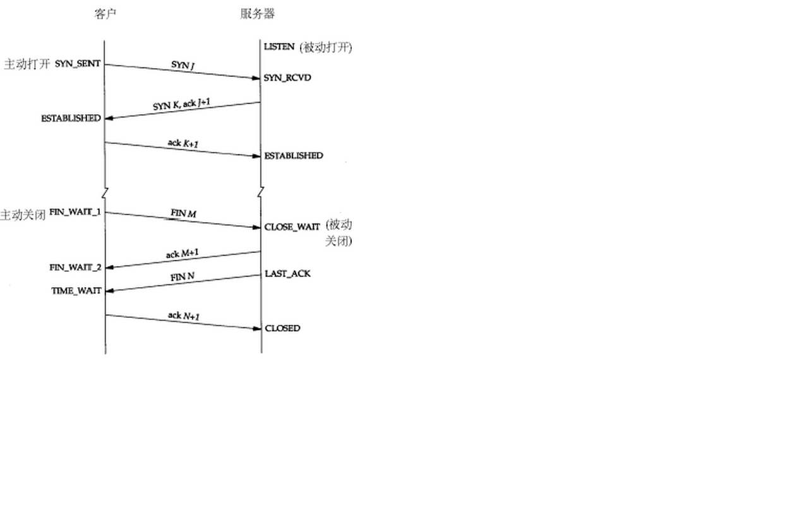

    
# tcp状态

# nmap
    nmap -p <port> <host>
    nmap -n --host-timeout 2 -p 77 -sU 1.1.1.1

# traceroute

Traceroute最简单的基本用法是：traceroute hostname

Traceroute程序的设计是利用ICMP及IP header的TTL（Time To Live）栏位（field）。首先，traceroute送出一个TTL是1的IP datagram（其实，每次送出的为3个40字节的包，包括源地址，目的地址和包发出的时间标签）到目的地，当路径上的第一个路由器（router）收到这个datagram时，它将TTL减1。此时，TTL变为0了，所以该路由器会将此datagram丢掉，并送回一个「ICMP time exceeded」消息（包括发IP包的源地址，IP包的所有内容及路由器的IP地址），traceroute 收到这个消息后，便知道这个路由器存在于这个路径上，接着traceroute 再送出另一个TTL是2 的datagram，发现第2 个路由器...... traceroute 每次将送出的datagram的TTL 加1来发现另一个路由器，这个重复的动作一直持续到某个datagram 抵达目的地。当datagram到达目的地后，该主机并不会送回ICMP time exceeded消息，因为它已是目的地了，那么traceroute如何得知目的地到达了呢？

Traceroute在送出UDP datagrams到目的地时，它所选择送达的port number 是一个一般应用程序都不会用的号码（30000 以上），所以当此UDP datagram 到达目的地后该主机会送回一个「ICMP port unreachable」的消息，而当traceroute 收到这个消息时，便知道目的地已经到达了。所以traceroute 在Server端也是没有所谓的Daemon 程式。
   server 192.168.122.1

# ping

# BitTorrent vs DHT

### 分布式哈希表 vs 一致性哈希算法